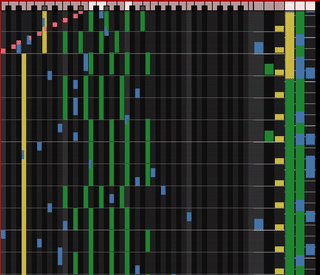

# TrOSCes

TrOSCes is a visualizer for electronic music generated by music programming
languages, especially for live coding.

## Motivation

When coding music, sometimes mistakes are made and unexpected sounds are
produced. Unexpected sounds are typically (though not always!) jarring and
indicate a bug in the music-producing code. Hunting for bugs - especially if
the buggy jarring music keeps on looping over and over again while you do so -
is a bit stressful so so any tools to "debug the loop" are helpful.

## Summary

TrOSCes is one such tool. It receives input from the programmed music in form
of OSC messages and use those messages to re-construct the track in a form
resembling a typical DAW that is immediately recognizable and understandable to
many electronic musicians:

To understand melodic, harmonic and rythmic structure:

 * Track of MIDI notes being played
 * Track of percussion/samples being played

To understand the larger-scale structure:

 * Track of layers

All tracks are updated and scroll in real-time along. While MIDI and percussion
tracks show the last couple of bars only, the layers track moves more slowly
and shows the progression of the last couple of minutes of your loop.

## Examples

See the sonic-pi/ directory for an example of how to send the OSC events and
how to potentially wire up your creation to be visualized by TrOSCes.

## Interface

Trosces understands the following OSC events:

### Sync

`/sync <bpm>`

Adjusts all timing of all tracks to align the current moment in time with a
beat and updates the BPM.

### Play

`/play <instrument: string> <note: string> [duration: in beats]`

Inserts a span for the the instrument in the MIDI track. If this is a new
instrument, a new color is allocated for it.

### Drum

`/drum <instrument: string> [duration: in beats]`

As above, but span is inserted to the pad track.

### Layer

`/drum <instrument: string> <duration: in beats> [variant: string]`

Similar to above, but duration is a required argument. Additionally, a
"variant" can be specified for the layer that will be drawn in a different
color.
